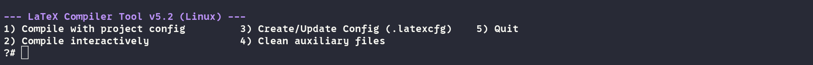
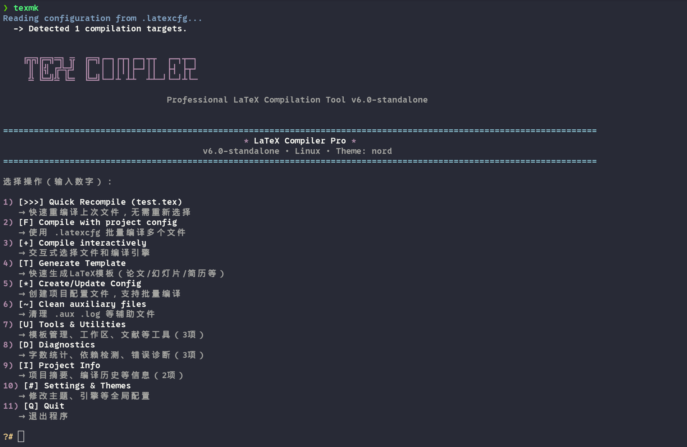

# LaTeX Compiler Pro v6.0 🚀

> 专业级 LaTeX 交互式编译脚本 - 现代化UI • 主题系统 • 智能管理 • 工作流优化


```bash
# LaTeX脚本配置 
# 放入~/.zshrc或者~/.bashrc
alias texmkone='/home/yyt/APPS/sh/latexcompile-simple.sh'
alias texmk='/home/yyt/APPS/sh/latexcompile-standalone.sh'
```

latexcompile-simple.sh效果如下



latexcompile-standalone.sh效果如下



---


## ✨ 核心特性

### 🎨 主题系统

- **7种精美预设**: Nord, Dracula, Sakura, Matrix, Gruvbox, Monokai, Default
- **24位真彩色**: 完整RGB色彩空间支持
- **主题预览**: 实时查看主题效果
- **持久化配置**: 自动保存用户选择

### 🖥️ 现代化UI

- **纯ASCII图标**: 兼容所有终端，无Emoji依赖
- **中文菜单说明**: 每个选项都有详细中文解释
- **Box边框装饰**: 精美的UI元素
- **进度动画**: 旋转指示器 + 进度条

### ⚙️ 智能管理 (16项功能)

- ✅ 快速重编译 - 一键使用相同配置
- ✅ 批量编译 - 项目配置支持
- ✅ 编译历史 - 最近10次记录
- ✅ 模板生成 - 6种内置模板
- ✅ 模板管理 - 自定义模板库
- ✅ 工作区管理 - 多项目快速切换
- ✅ 文献管理 - BibTeX工具集
- ✅ 字数统计 - 支持LaTeX语法
- ✅ 依赖检测 - 检查缺失宏包
- ✅ 错误诊断 - 智能分析日志
- ✅ 项目摘要 - 文件统计概览
- ✅ 主题设置 - 个性化配置

### 📚 文档支持

- 📄 [**完整教程**](TUTORIAL.md) - 从入门到精通
- 📖 [**功能总览**](FEATURES_FULL.md) - 所有功能详解
- 📝 [**快速指南**](USAGE.md) - 单文件版说明
- 🎯 [**功能说明**](FEATURES.md) - 菜单项详解
- 🎉 [**实现演示**](file:///home/yyt/.gemini/antigravity/brain/0e17f2f9-3562-4e2e-9667-c0663d11be67/walkthrough.md) - Walkthrough

---

## 📦 安装

### 前置依赖

```bash
# Fedora 43
sudo dnf install latexmk texlive-scheme-full

# 可选：字数统计工具
sudo dnf install texcount
```

### 脚本安装

```bash
cd /home/yyt/Downloads/sh

# 单文件版（推荐 - 便于迁移）
chmod +x latexcompile-standalone.sh
./latexcompile-standalone.sh

# 模块化版（易于维护）
chmod +x latexcompile.sh themes.sh ui_components.sh
./latexcompile.sh
```

**首次运行自动创建**：

- `~/.latexrc` - 全局配置
- `~/.latex_templates/` - 模板库
- `~/.latex_workspaces` - 工作区列表
- `~/.latex_history` - 编译历史

---

## 🚀 快速开始

### 命令行模式

```bash
# 使用默认引擎（xelatex）
./latexcompile-standalone.sh document.tex

# 指定编译引擎
./latexcompile-standalone.sh document.tex -e pdflatex
./latexcompile-standalone.sh document.tex -e lualatex

# 查看帮助
./latexcompile-standalone.sh --help
```

### 交互式模式

```bash
./latexcompile-standalone.sh

# 主菜单会显示16个功能选项
# 每个选项都有详细中文说明
```

---

## 🎯 主要功能

### 编译功能

- **[>>>] Quick Recompile** - 快速重编译上次文件，无需重新选择
- **[F] Compile with config** - 使用.latexcfg批量编译多个文件
- **[+] Compile interactively** - 交互式选择文件和编译引擎

### 模板与文档

- **[T] Generate Template** - 快速生成6种LaTeX模板
  - Article (学术论文)
  - Beamer (演示幻灯片)
  - Book (书籍/论文)
  - Homework (作业模板)
  - Letter (信件)
  - CV/Resume (简历)
- **[M] Manage Templates** - 自定义模板管理（保存/使用/删除）
- **[B] Manage Bibliography** - BibTeX文献管理

### 分析与诊断

- **[=] Word Count** - 字数统计（支持texcount或基础统计）
- **[?] Check Dependencies** - LaTeX包依赖检测
- **[!] Diagnose Errors** - 智能LaTeX错误诊断
- **[i] Project Summary** - 项目文件统计和配置摘要

### 项目管理

- **[W] Workspace Manager** - 项目工作区管理
  - 保存常用项目路径
  - 快速切换工作目录
  - 自动重载项目配置
- **[@] Compilation History** - 编译历史记录（最近10次）
- **[*] Create Config** - 项目配置创建向导
- **[#] Settings & Themes** - 全局设置和7种主题

---

## 📖 使用示例

### 示例1：快速编译论文

```bash
# 第一次编译
./latexcompile-standalone.sh paper.tex

# 修改文档后快速重编译
./latexcompile-standalone.sh
# 选择: 1) [>>>] Quick Recompile (paper.tex)
```

### 示例2：从模板开始

```bash
./latexcompile-standalone.sh
# 选择: 4) [T] Generate Template
# 选择: 1 (Article)
# 文件名: my_paper
# 立即编译: y
```

### 示例3：管理多个项目

```bash
# 保存第一个项目
cd ~/Documents/thesis/
./latexcompile-standalone.sh
# 选择: 6) [W] Workspace Manager → Add current directory
# 名称: Thesis2024

# 保存第二个项目
cd ~/Work/paper/
# 重复上述操作

# 快速切换
./latexcompile-standalone.sh
# 选择: 6) [W] → Switch to workspace → Thesis2024
```

---

## ⚙️ 配置系统

### 配置优先级

脚本支持**三层配置系统**，优先级从高到低：

```
项目配置 (.latexcfg) → 全局配置 (~/.latexrc) → 默认值
```

### 全局配置文件 (~/.latexrc)

适用于所有项目的默认设置：

```ini
[General]
default_engine = xelatex      # 默认编译引擎
auto_cleanup = false          # 自动清理辅助文件
auto_open_pdf = true          # 自动打开PDF
editor = nvim                 # 文本编辑器

[Theme]
active_theme = nord           # 当前主题

[Features]
enable_history = true         # 启用编译历史
max_history = 10              # 历史记录条数

[PDF]
viewer = zathura              # PDF查看器（留空使用系统默认）
```

### 项目配置文件 (.latexcfg)

#### 方式1: 仅配置编译目标（原有格式）

```ini
# 多文件项目批量编译配置
TARGET_1_FILE = "main.tex"
TARGET_1_ENGINE = "xelatex"
TARGET_1_BIB_TOOL = "biber"

TARGET_2_FILE = "appendix.tex"
TARGET_2_ENGINE = "xelatex"
TARGET_2_BIB_TOOL = "none"
```

#### 方式2: 完整项目配置（新功能 v6.0+）

覆盖全局设置，实现项目特定配置：

```ini
# ======================================
# 项目级配置覆盖示例
# ======================================

# 💡 项目特定主题 - 不同项目可用不同配色
[Theme]
active_theme = matrix         # 为此项目使用 matrix 主题

# 💡 项目特定编译设置
[General]
default_engine = lualatex     # 覆盖全局的 xelatex
auto_cleanup = true           # 启用自动清理
editor = code                 # 使用 VSCode
auto_open_pdf = false         # 禁用自动打开

# 💡 项目特定功能设置
[Features]
enable_history = false        # 禁用历史记录
max_history = 5               # 限制历史记录数量

# 💡 项目特定PDF查看器
[PDF]
viewer = okular               # 使用 okular 代替全局查看器

# 💡 编译目标配置
[Targets]
MAIN_FILE = thesis.tex
ENGINE = xelatex
BIB_TOOL = biber

TARGET_1_FILE = thesis.tex
TARGET_1_ENGINE = xelatex
TARGET_1_BIB_TOOL = biber

TARGET_2_FILE = presentation.tex
TARGET_2_ENGINE = pdflatex
```

### 配置使用场景

#### 场景1: 学术论文项目

```ini
# ~/Documents/thesis/.latexcfg
[Theme]
active_theme = nord           # 专业冷色调

[General]
default_engine = xelatex      # 中文支持
auto_cleanup = false          # 保留辅助文件以便调试

[Targets]
MAIN_FILE = main.tex
ENGINE = xelatex
BIB_TOOL = biber
```

#### 场景2: 演示文稿项目

```ini
# ~/Presentations/conf2024/.latexcfg
[Theme]
active_theme = dracula        # 炫彩主题适合演示

[General]
default_engine = pdflatex
auto_open_pdf = true          # 演示需要立即预览

[Targets]
MAIN_FILE = slides.tex
ENGINE = pdflatex
```

#### 场景3: 多语言书籍项目

```ini
# ~/Books/multilang/.latexcfg
[General]
default_engine = lualatex     # LuaLaTeX 最佳多语言支持
auto_cleanup = true

[Targets]
TARGET_1_FILE = english.tex
TARGET_1_ENGINE = lualatex

TARGET_2_FILE = chinese.tex
TARGET_2_ENGINE = xelatex     # 中文章节用 XeLaTeX
```

### 查看配置状态

在脚本中选择 **Project Info → Project Summary** 查看当前配置：

```
Configuration Status:
  Project config:  [OK] .latexcfg found
  └─> Overrides: theme, engine, cleanup, editor
  User config:     [OK] ~/.latexrc

Active Settings:
  Engine:       lualatex (project)
  Theme:        matrix (project)
  Auto-cleanup: enabled (project)
  Editor:       nvim (global)
```

每个配置项后标注 `(project)` 或 `(global)` 表示来源。

---

## 🎨 主题展示

| 主题 | 风格 | 适合场景 |
|------|------|---------|
| **nord** | 北欧极光，冷色调 | 长时间使用 |
| **dracula** | 暗黑紫粉 | 夜间工作 |
| **sakura** | 樱花粉嫩 | 视觉舒适 |
| **matrix** | 绿色矩阵 | 极客风格 |
| **gruvbox** | 复古暖色 | 经典美学 |
| **monokai** | 经典暗黑 | 编程风格 |
| **default** | 原始配色 | 简约实用 |

切换主题：菜单选择 `[#] Settings & Themes → Change Theme`

---

## 📊 技术统计

| 指标 | 数值 |
|------|------|
| 总代码行数 | ~2018行 |
| 功能函数数 | 45个 |
| 主要功能 | 16项 |
| 支持模板 | 6种内置 + 无限自定义 |
| 主题方案 | 7种 |
| 配置文件 | 4个 |

---

## 🐛 故障排除

### 找不到latexmk

```bash
sudo dnf install latexmk
```

### 字数统计不可用

```bash
# 安装texcount（推荐）
sudo dnf install texcount

# 或使用脚本内置的基础统计（无需安装）
```

### 主题颜色不生效

确保终端支持24位真彩色：

```bash
echo $COLORTERM
# 应输出: truecolor 或 24bit
```

### Emoji图标显示乱码

**已解决**：v6.0使用纯ASCII字符，无Emoji依赖

---

## 📚 完整文档索引

- **[TUTORIAL.md](TUTORIAL.md)** - 📖 完整使用教程（推荐新手阅读）
- **[FEATURES_FULL.md](FEATURES_FULL.md)** - 📋 全部功能详解
- **[USAGE.md](USAGE.md)** - ⚡ 快速使用指南
- **[FEATURES.md](FEATURES.md)** - 🎯 功能说明详解
- **[walkthrough.md](file:///home/yyt/.gemini/antigravity/brain/0e17f2f9-3562-4e2e-9667-c0663d11be67/walkthrough.md)** - 🎉 实现演示

---

## 🔮 未来计划

- [ ] Web UI界面
- [ ] Git集成
- [ ] 云同步支持
- [ ] PDF元数据编辑
- [ ] 图片优化工具

---

## 📝 更新日志

### v6.0 (2026-01-19) - 旗舰版

- ✨ 新增7种主题系统
- ✨ 现代化UI重构（24位真彩色 + ASCII图标）
- ✨ 编译历史记录（最近10次）
- ✨ 快速重编译功能
- ✨ 模板管理系统（内置6种 + 自定义模板库）
- ✨ 项目工作区管理
- ✨ **项目级配置系统** - 每个项目可覆盖全局配置
- ✨ 字数统计集成（支持fallback）
- ✨ 依赖包检测
- ✨ LaTeX错误智能诊断
- ✨ 项目信息摘要（支持配置来源显示）
- ✨ 文献管理工具
- ✨ 设置管理中心
- ✨ 中文菜单说明
- ♻️ 模块化架构重构
- 🐛 修复Emoji显示问题

### v5.2 (之前版本)

- 基础编译功能
- 项目配置支持
- 批量编译

---

## 👨‍💻 作者信息

- **脚本作者**: SMLYFM
- **版本**: v6.0 旗舰版
- **环境**: Fedora 43 • Zsh • Ptyxis Terminal
- **代码行数**: 2018行
- **功能模块**: 45个函数

---

## 📄 许可证

MIT License - 自由使用和修改

---

## 💡 使用技巧

### 创建命令别名

```bash
echo "alias texc='~/Downloads/sh/latexcompile-standalone.sh'" >> ~/.zshrc
source ~/.zshrc

# 之后只需
texc document.tex
```

### 推荐工作流

**日常写作**：

```
Quick Recompile → 修改 → Quick Recompile (循环)
```

**新建项目**：

```
Generate Template → 编辑 → 保存为工作区
```

**多项目管理**：

```
Workspace Manager → 快速切换项目
```

---

**享受现代化的LaTeX编译体验！** 🎉✨

---

## ✨ 核心特性

### 🎨 主题系统

- **7种精美预设**: Default, Nord, Dracula, Sakura, Matrix, Gruvbox, Monokai
- **24位真彩色**: 支持现代终端的完整色彩空间
- **主题预览**: 实时查看主题效果
- **一键切换**: 配置自动保存

### 🖥️ 现代化UI

- **Unicode图标**: 20+ 精选图标，提升视觉体验
- **Box边框**: 精美的边框装饰和分隔线
- **进度指示**: 编译进度可视化
- **智能菜单**: 动态菜单项，根据上下文调整

### ⚙️ 智能管理

- **编译历史**: 自动记录最近10次编译
- **快速重编译**: 一键使用相同配置重编译
- **配置中心**: INI格式配置文件，支持GUI编辑
- **批量编译**: 项目配置支持多文件管理

### 📊 实用工具

- **字数统计**: 集成texcount，支持中英文混排
- **自动清理**: 可配置的辅助文件清理
- **PDF查看**: 自定义PDF查看器
- **错误诊断**: 智能显示编译日志错误

---

## 📦 安装

### 前置依赖

```bash
# Fedora 43
sudo dnf install latexmk texlive-scheme-full

# 可选：字数统计工具
sudo dnf install texcount
```

### 安装脚本

```bash
cd /home/yyt/Downloads/sh

# 设置执行权限
chmod +x latexcompile.sh themes.sh ui_components.sh

# 首次运行会自动创建配置文件
./latexcompile.sh
```

---

## 🚀 快速开始

### 交互式模式

```bash
./latexcompile.sh
```

### 命令行模式

```bash
# 使用默认引擎 (xelatex)
./latexcompile.sh document.tex

# 指定编译引擎
./latexcompile.sh document.tex -e pdflatex
./latexcompile.sh document.tex -e lualatex

# 查看帮助
./latexcompile.sh --help
```

---

## 🎨 主题展示

### Nord (默认)

```
北欧极光风格 - 冷色调专业感
Primary: #88C0D0 | Success: #A3BE8C
```

### Dracula

```
暗黑吸血鬼主题 - 紫粉炫彩
Primary: #BD93F9 | Success: #50FA7B
```

### Sakura

```
樱花主题 - 温暖粉嫩
Primary: #FFB6C1 | Success: #98FB98
```

### Matrix

```
黑客帝国 - 绿色矩阵
Primary: #00FF00 | Success: #32CD32
```

---

## ⚙️ 配置

### 配置文件位置

- **用户配置**: `~/.latexrc`
- **项目配置**: `.latexcfg` (当前目录)
- **编译历史**: `~/.latex_history`

### 配置示例

```ini
[General]
default_engine = xelatex      # 默认引擎
auto_cleanup = false          # 自动清理
editor = nvim                 # 编辑器
auto_open_pdf = true          # 自动打开PDF

[Theme]
active_theme = nord           # 激活主题

[Features]
enable_history = true         # 启用历史
max_history = 10              # 历史条目数

[PDF]
viewer = zathura              # PDF查看器
```

---

## 📋 功能菜单

```
1) 🚀 Quick Recompile         - 快速重编译上次文件
2) 📄 Compile with config     - 使用项目配置批量编译
3) 📝 Compile interactively   - 交互式选择文件和引擎
4) 📊 Word Count              - 字数和统计信息
5) 📋 History                 - 查看编译历史
6) ⚙️ Create/Update Config    - 配置文件生成向导
7) 🎨 Settings & Themes       - 设置中心和主题管理
8) 🧹 Clean                   - 清理辅助文件
9) 🚪 Quit                    - 退出
```

---

## 🔧 技术细节

### 架构设计

```
latexcompile.sh (主脚本, 29KB)
├─ themes.sh (7种主题定义)
└─ ui_components.sh (UI组件库)
```

### 支持的编译引擎

- **XeLaTeX** (默认) - 推荐用于中文文档
- **PDFLaTeX** - 经典引擎
- **LuaLaTeX** - 现代Lua引擎

### 支持的文献工具

- **Biber** (推荐用于biblatex)
- **BibTeX** (传统文献管理)

---

## 📸 截图

主界面使用Nord主题的效果（详见 [walkthrough.md](file:///home/yyt/.gemini/antigravity/brain/0e17f2f9-3562-4e2e-9667-c0663d11be67/walkthrough.md)）

---

## 🐛 故障排除

### 找不到latexmk

```bash
sudo dnf install latexmk
```

### 字数统计不可用

```bash
sudo dnf install texcount
```

### 主题不生效

确保终端支持24位真彩色：

```bash
echo $COLORTERM
# 应输出: truecolor 或 24bit
```

---

## 📚 文档

- **完整指南**: [walkthrough.md](file:///home/yyt/.gemini/antigravity/brain/0e17f2f9-3562-4e2e-9667-c0663d11be67/walkthrough.md)
- **实施计划**: [implementation_plan.md](file:///home/yyt/.gemini/antigravity/brain/0e17f2f9-3562-4e2e-9667-c0663d11be67/implementation_plan.md)

---

## 🔮 未来计划

- [ ] LaTeX模板管理系统
- [ ] 智能依赖包检测
- [ ] 增强错误诊断
- [ ] 项目工作区管理
- [ ] 实时编译动画

---

## 📝 更新日志

### v6.0 (2026-01-19)

- ✨ 新增7种主题系统
- ✨ 现代化UI重构 (24位真彩色 + Unicode)
- ✨ 编译历史记录
- ✨ 快速重编译功能
- ✨ 字数统计集成
- ✨ 设置管理中心
- ♻️ 模块化架构重构

### v5.2 (之前版本)

- 基础编译功能
- 项目配置支持
- 批量编译

---

## 👨‍💻 作者

- **脚本作者**: SMLYFM
- **版本**: v6.0 旗舰版
- **环境**: Fedora 43 • Zsh • Ptyxis Terminal

---

## 📄 许可证

MIT License - 自由使用和修改

---

**享受现代化的LaTeX编译体验！** 🎉
